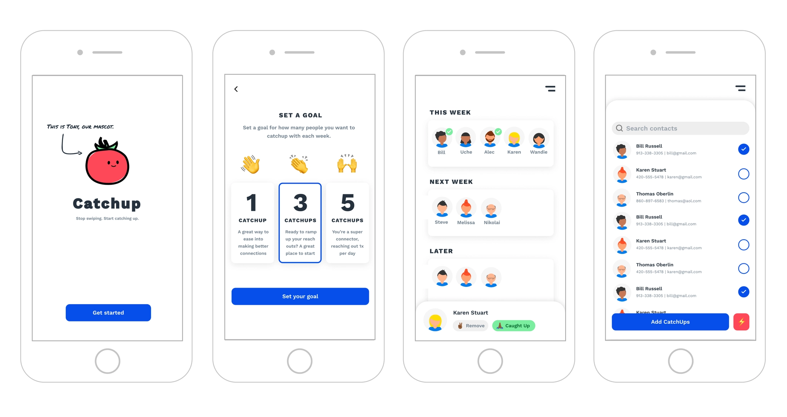
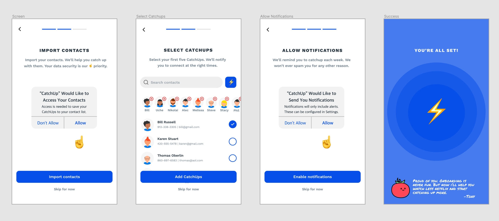
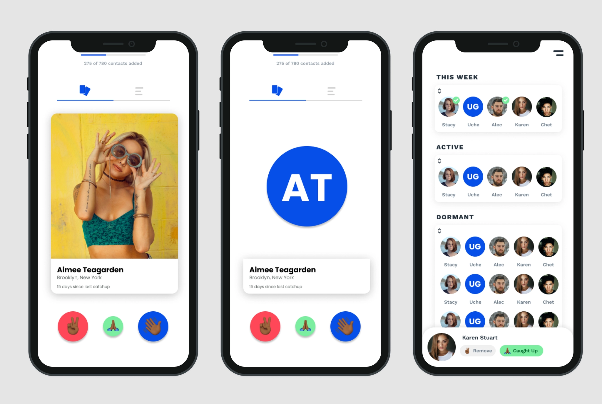
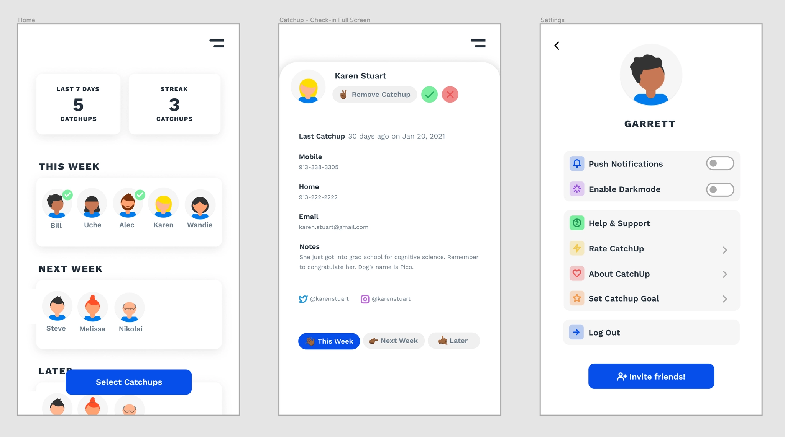
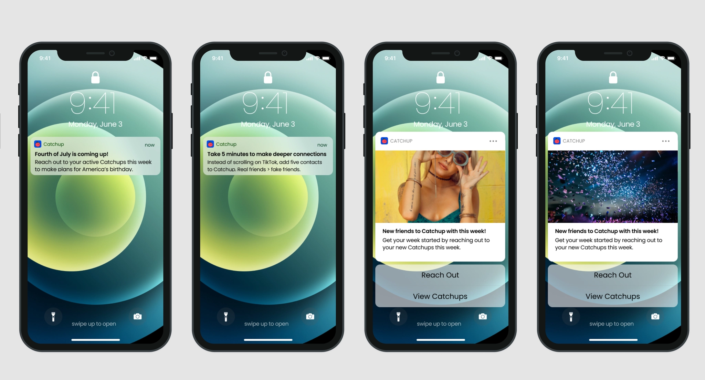

# Catchup

**Stop swiping. Start catching up.** (iOS)

Rediscover and reconnect with your contacts in just a few taps. Set a weekly
catchup goal, add contacts to your catchups list, and deepen your real
connections.

The hope: spend more time off your phone and more quality time with the
important people in your life. Catchup is a little nudge to send that first
text — and then your companion as your relationships grow. Mascot: Tony, a
tomato.

- **Type:** iOS app
- **Showcase:** https://app.airport.community/app/reccnvYGUjZi0cCaC

## Screenshots

Onboarding — get started, set a weekly goal, and organize people into This Week / Next Week / Later:

Onboarding flow — import contacts, pick your first catchups, enable notifications, all set:

The card UI and the This Week / Active / Dormant contact lists:

Home stats, a contact check-in screen, and settings:

Weekly reminder push notifications:

