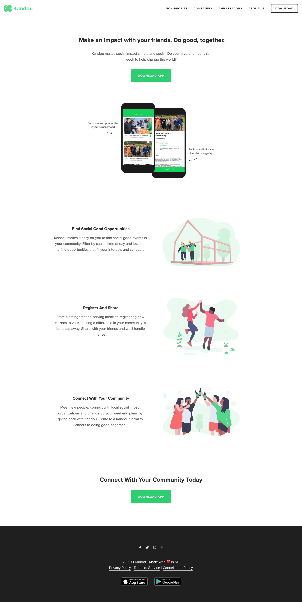
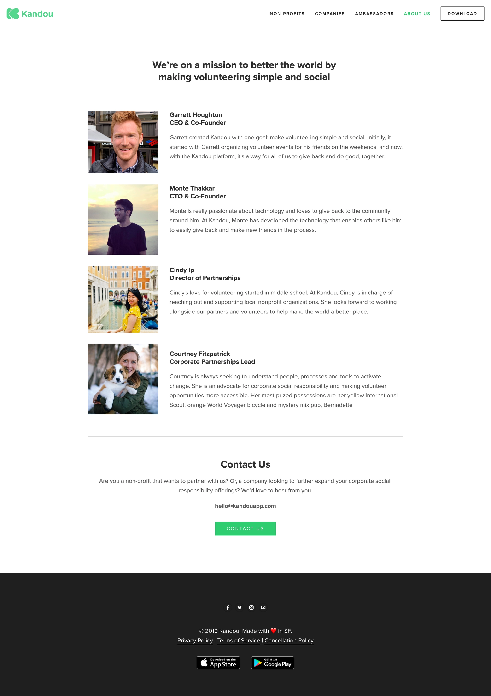
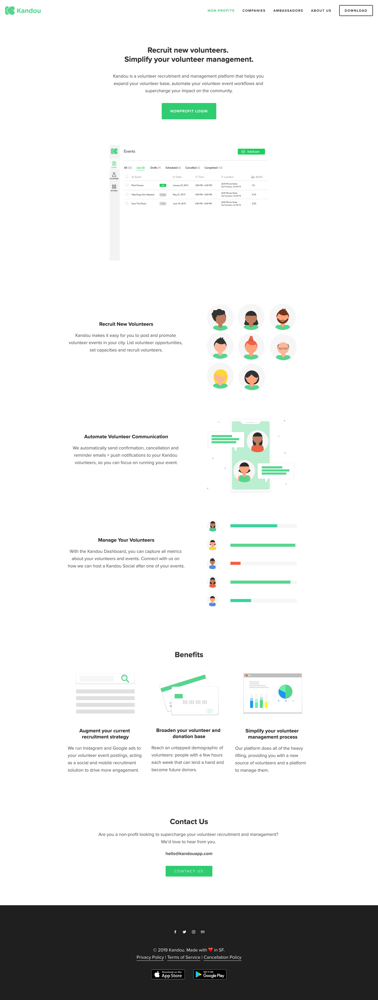
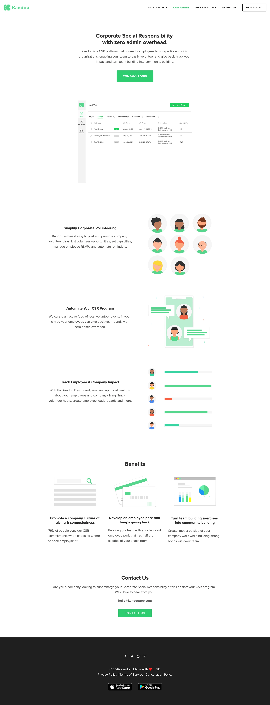
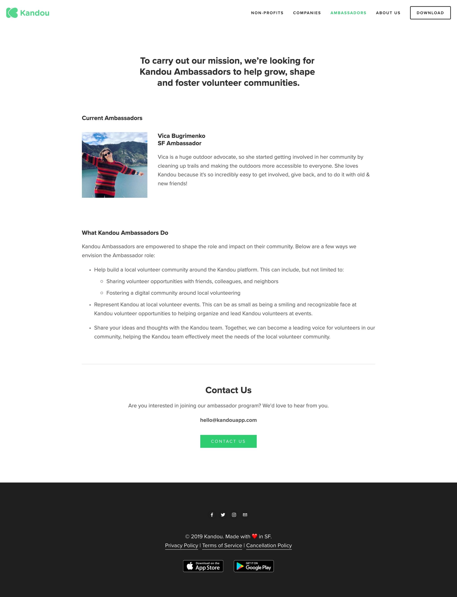

# Kandou

**We make volunteering simple and social.** (iOS, Android, Web)

Kandou matches you with volunteer opportunities in your area and brings you
together with other like-minded people. Volunteer with Kandou and do good,
together!

Built in React Native (iOS & Android) with a web app and server, plus CSR
management tools for organizations. Reached 600 users across 17 San Francisco
nonprofits, facilitating 25 volunteer events and 125+ community service hours.

- **Type:** iOS, Android, Web
- **Website:** https://www.kandouapp.com/
- **Twitter:** https://twitter.com/kandouapp
- **Source:** private repos `kandou-app-legacy` (mobile) and `kandou-web-legacy` (web + server)

## Screenshots

Home:

About us:

For nonprofits:

For companies:

Ambassadors:

