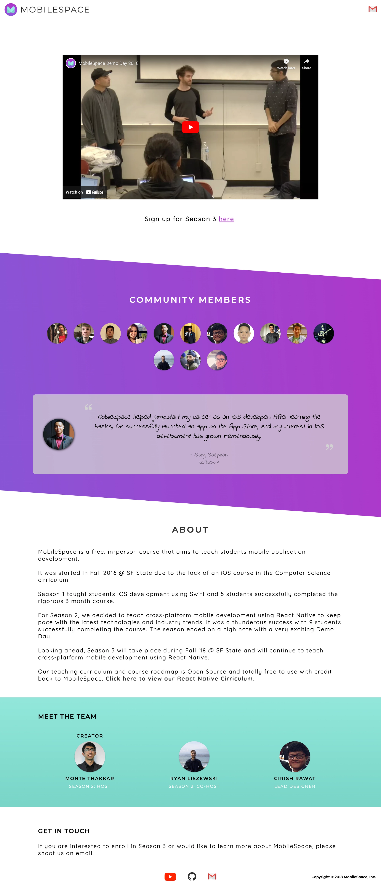

# MobileSpace

A free, in-person course that teaches students mobile application development.

Started in Fall 2016 as an iOS course at SF State to fill a gap in the CS
curriculum, MobileSpace grew into a multi-season program. Season 2 (Feb–Apr
2018) ran weekly at the SF State Library, teaching React Native from the
fundamentals through a group-built social app and a demo day — with the goal of
helping students land internships and full-time engineering roles.

- **Type:** In-person course (San Francisco)
- **Roadmap / curriculum:** https://github.com/mobilespace/Season2
- **Org (all seasons, guides, projects):** https://github.com/mobilespace

## Screenshots

The MobileSpace website (mobilespace.xyz):

